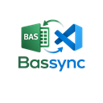

<p align="center">
  
</p>

<h1 align="center">Bassync</h1>

<p align="center">
  Edit Excel VBA modules directly from VS Code — live, bidirectional sync with a running Excel instance.
</p>

<p align="center">
  
  
  
</p>

---

## Features

- 🔌 **Attach to any open workbook** — picks up all running Excel instances, even across multiple processes
- ⬇️ **Pull on attach** — all VBA modules extracted to a local folder, opened as its own VS Code window
- 💾 **Push on save** — `Ctrl+S` in VS Code pushes changes live into Excel's VBA editor instantly
- ➕ **Add modules** — create a `.bas` or `.cls` file and a new VBA component appears in Excel automatically
- ➖ **Remove modules** — delete a file and the component is removed from Excel automatically
- 🎀 **Ribbon XML editor** — edit `customUI14.xml` in VS Code; the workbook reloads in Excel to apply changes
- 🧹 **Auto-cleanup** — the local mirror folder is deleted when you close the VS Code window

---

## Requirements

| Requirement | Detail |
|---|---|
| **OS** | Windows only (Excel COM automation is a Windows API) |
| **Excel** | 2016 or later, with the target workbook open |
| **PowerShell** | 5.1+ — built into Windows, no installation needed |
| **Trust setting** | Must be enabled once per machine — see [Setup](#setup) below |

---

## Setup

### 1 — Enable VBA project trust in Excel

This is a **one-time** setting per machine. Without it, Excel blocks programmatic access to the VBA object model.

> **Excel → File → Options → Trust Center → Trust Center Settings → Macro Settings**
> ✅ Check **"Trust access to the VBA project object model"**

### 2 — Install Bassync

Install from the [VS Code Marketplace](https://marketplace.visualstudio.com) or via the Extensions panel (`Ctrl+Shift+X`) — search for **Bassync**.

---

## Quick Start

1. Open your `.xlsm` workbook in Excel
2. In VS Code, open the Command Palette (`Ctrl+Shift+P`)
3. Run **Bassync: Attach to Workbook…**
4. Select your workbook from the list
5. A new VS Code window opens with all your VBA files ready to edit

---

## Usage

### Editing VBA

Open any `.bas` or `.cls` file and edit freely. Every `Ctrl+S` pushes the change live into Excel — no reload, no copy-paste.

The status bar shows **`⟳ Bassync: MyBook.xlsm`** while connected. On save it briefly shows a spinning icon, then a checkmark.

### Adding a new module

In the Explorer panel, right-click → **New File** → name it `MyModule.bas` (standard module) or `MyClass.cls` (class module). The component is created in Excel immediately and the workbook is saved automatically.

### Removing a module

Delete the `.bas` or `.cls` file. The VBA component is removed from Excel and the workbook is saved automatically.

> **Note:** Document modules (`ThisWorkbook`, `Sheet1`, etc.) are owned by Excel and cannot be removed — attempting to delete their `.cls` file will show an error, leaving the workbook untouched.

### Editing the ribbon

Open `ribbon/customUI14.xml`. This file contains the Custom UI XML that controls Excel's ribbon tabs, groups, and buttons. Edit it and save — Bassync will:

1. Save the workbook in Excel
2. Close it briefly
3. Patch the XML inside the `.xlsm` file
4. Reopen the workbook automatically

If no custom ribbon exists yet, a starter template is provided so you always have something to build from.

### Closing the mirror window

When you close the mirror VS Code window, the local `.bassync` folder is deleted automatically. Your VBA code remains safe inside Excel's memory and in the `.xlsm` file — only the temporary text mirror on disk is removed.

---

## Mirror folder structure

After attaching, a folder is created **next to your `.xlsm` file**:

```
MyBook.bassync/
├── manifest.json          ← internal metadata (do not edit)
├── Module1.bas            ← Standard Module
├── ThisWorkbook.cls       ← Document Module
├── Sheet1.cls             ← Document Module
├── MyHelper.cls           ← Class Module
└── ribbon/
    └── customUI14.xml     ← Custom UI ribbon XML
```

---

## How it works

Bassync uses **PowerShell** as its bridge to Excel's COM object model — no native C++ compilation or build tools required. It enumerates all running Excel instances via the Windows **Running Object Table (ROT)**, so it finds every open workbook even across multiple separate `EXCEL.EXE` processes.

```
┌─────────────────┐   pull on attach    ┌─────────────────────┐
│  Excel VBProject │ ──────────────────► │   MyBook.bassync/   │
│  (COM via PS)    │                     │     Module1.bas      │
│                  │ ◄────────────────── │     Sheet1.cls       │
└─────────────────┘   push on Ctrl+S    │     ribbon/          │
                                         │       customUI14.xml │
      .xlsm ZIP ◄── ribbon patch ───────┘
```

The ribbon XML lives **inside the `.xlsm` ZIP archive** (not in Excel's memory), so it is patched differently: Bassync saves and closes the workbook via COM, modifies the ZIP directly, then reopens it.

---

## Supported component types

| VBA Type | Extension | Read | Write | Add | Remove |
|---|---|:---:|:---:|:---:|:---:|
| Standard Module | `.bas` | ✅ | ✅ | ✅ | ✅ |
| Class Module | `.cls` | ✅ | ✅ | ✅ | ✅ |
| Document Module *(ThisWorkbook, sheets)* | `.cls` | ✅ | ✅ | — | — |
| UserForm | `.frm` | ❌ | ❌ | ❌ | ❌ |
| ActiveX Designer | — | ❌ | ❌ | ❌ | ❌ |

UserForms are skipped because their `.frx` binary companion file cannot be reliably round-tripped as plain text.

---

## Known limitations

- **Windows only** — Excel COM automation is a Windows-exclusive API
- **UserForms not supported** — see table above
- **Ribbon changes require a workbook reload** — Bassync automates this, but it means the workbook briefly closes and reopens in Excel each time you save the ribbon XML
- **VBA changes are not auto-saved to the `.xlsm` file** — Bassync pushes changes into Excel's in-memory VBProject. To persist them to the file itself, save the workbook in Excel (`Ctrl+S` in Excel)

---

## License

[MIT](LICENSE)

